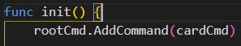
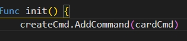
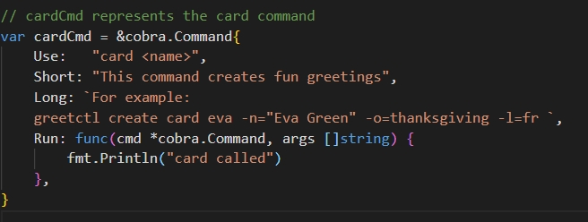
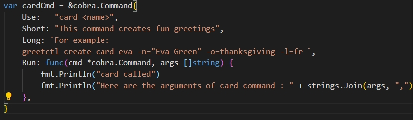

1. go mod init greetctl (Create a go module for CLI.)
   
2. go get -u github.com/spf13/cobra/cobra (Get Cobra library)
 
4. cobra init --pkg-name greetctl (Create a bare minimum skeleton)
   
5. go get github.com/mitchellh/go-homedir@v1.1.0 (library required to get home-dir without cgo)
   
6. run the command go run main.go to test.
   
7.  To add a new command do cobra add create. New go file will be created under ./cmd/create.go
   
8.  Do cobra add card, By default, both create and card commands will be added to the top-level command (root.go). But we want to add card (card.go) sub-command to create (create.go) command instead of top-level command (root.go) so lets edit /cmd/card.go. Add cardCmd in createCmd instead of rootCmd. </br>
 </br>
 </br>

8. Update cardCmd as per given specification <br>
 </br>

## Reading Arguments 

1. Try "go run main.go create card my-card" and add to card.go as picture given Below:
 </br>

## Adding Flags

So far we know, how to create commands and read arguments. In this section, we will create few flags with descriptions and read them in the program.

1. Flags can be read in the card.go with 
```

Run: func(cmd *cobra.Command, args []string) {
  name, _ := cmd.Flags().GetString("name")
  language, _ := cmd.Flags().GetString("language")
  fmt.Println("value of the flag name :" + name)
  fmt.Println("value of the flag language :" + language)
},

``` 

## Install CTL

Once you are done with all the changes you should create binary using following command.

```

go install greetctl

```